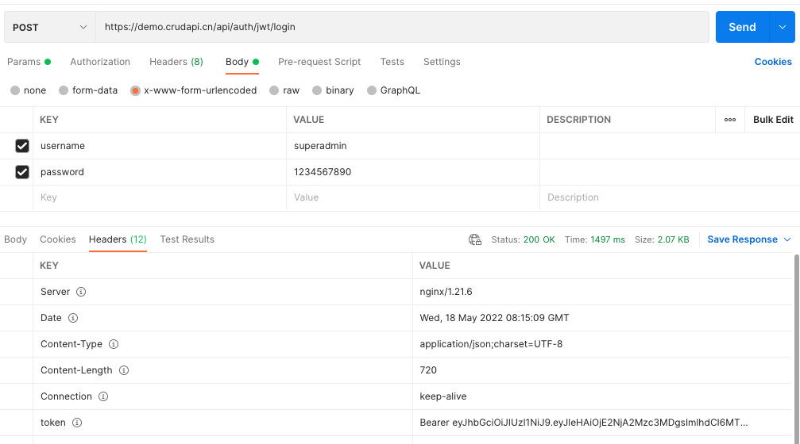
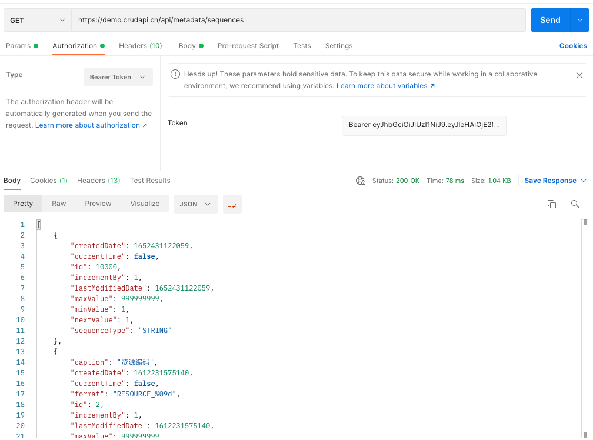
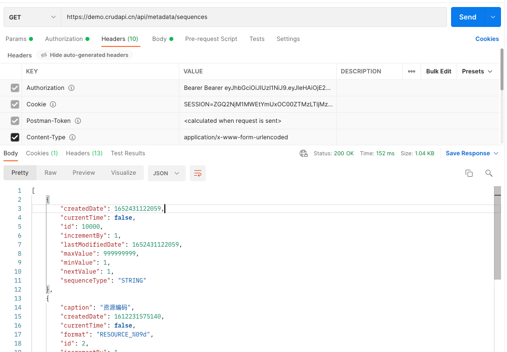
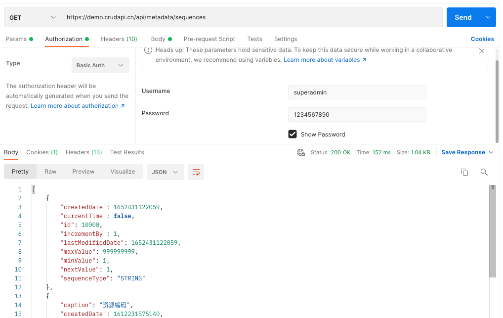
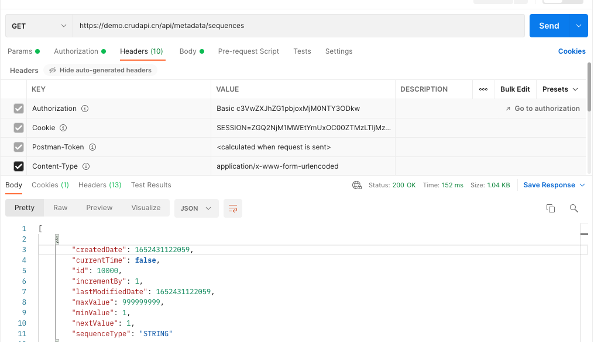

# swagger api
https://demo.crudapi.cn/swagger-ui.html

# user
superadmin/1234567890

# login
## option 1: Cookie

### api
```
POST https://demo.crudapi.cn/api/auth/login
accept: application/json
content-type: application/x-www-form-urlencoded
username: superadmin
password: 1234567890
```

## option 2: Jwt token
### api
```
POST https://demo.crudapi.cn/api/auth/jwt/login
accept: application/json
content-type: application/x-www-form-urlencoded
username: superadmin
password: 1234567890
```



### get jwt token
get "token" field form response header: Bearer XXXXX

### set jwt token
#### set Bearer Token Type: Bearer XXXXX
Both "Bearer XXXXX" and "XXXX" is valid


#### View Authorization
"Authorization" field of request header: Bearer XXXXX


## option 3: Basic Auth

### set Basic auth
#### set Basic Auth Type: superadmin/1234567890


#### View Authorization
"Authorization" field of request header: Basic c3VwZXJhZG1pbjoxMjM0NTY3ODkw



# logout
GET https://demo.crudapi.cn/api/auth/logout

# create user
POST https://demo.crudapi.cn/api/business/user
```
{
    "name": "testuser",
    "username": "testuser",
    "password": "testuser",
    "enabled": true,
    "accountNonExpired": true,
    "accountNonLocked": true,
    "credentialsNonExpired": true,
    "fileId": null,
    "avatar": null,
    "roleLines": [{
        "name": "业务数据角色",
        "role": {
            "id": 20,
            "name": "业务数据角色",
        },
        "roleId": 20
    }]
}
```
