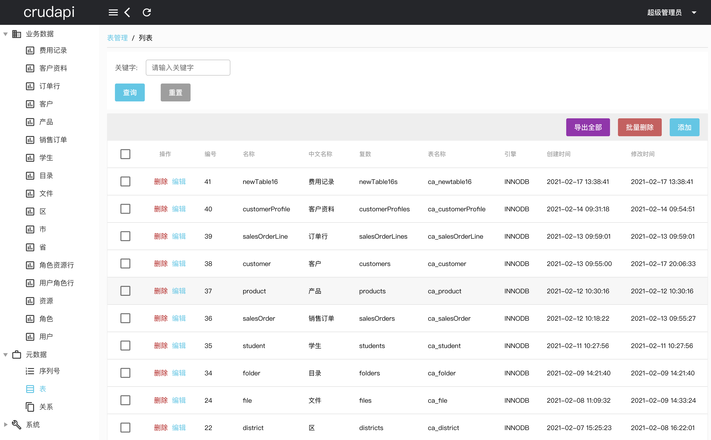
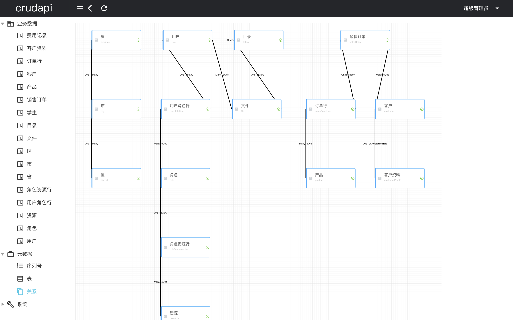
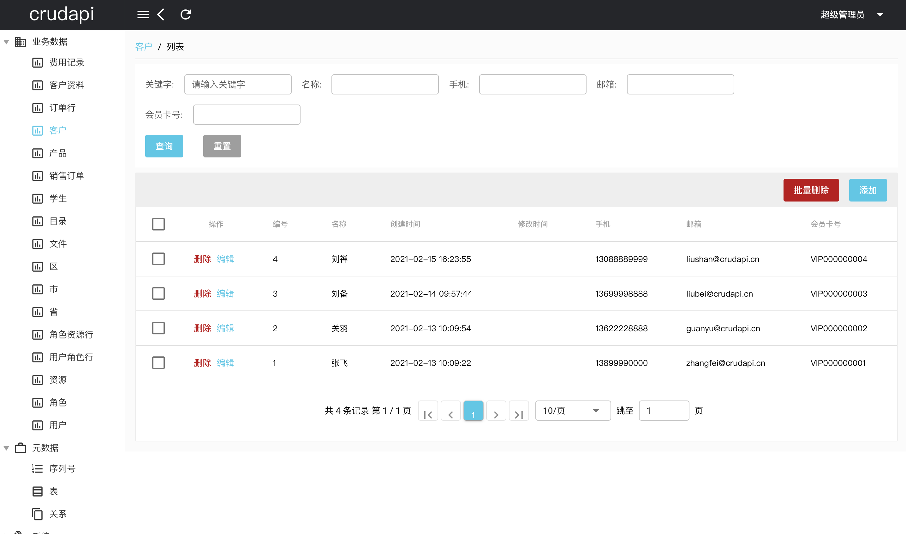

# Second development demo

## Language
[中文](README_CN.md)

## GIT URL
### GitHub repo
[https://github.com/crudapi/crudapi-example](https://github.com/crudapi/crudapi-example)

### Gitee repo
[https://gitee.com/crudapi/crudapi-example](https://gitee.com/crudapi/crudapi-example)

### download crudapi jar
```bash
cd lib
./download.sh
```

### Install crudapi jar
```bash
mvn install:install-file -Dfile=./lib/crudapi-core-1.0.0.jar -DgroupId=cn.crudapi -DartifactId=crudapi-core -Dversion=1.0.0 -Dpackaging=jar

mvn install:install-file -Dfile=./lib/crudapi-api-1.0.0.jar -DgroupId=cn.crudapi -DartifactId=crudapi-api -Dversion=1.0.0 -Dpackaging=jar
```

### Import database
./mysql/crudapi.sql

### Config MySql properties
src/main/resources/application.properties
```bash
spring.datasource.url=jdbc:mysql://localhost:3306/crudapi?serverTimezone=Asia/Shanghai&useUnicode=true&characterEncoding=utf8&useSSL=false&allowPublicKeyRetrieval=true
spring.datasource.username=root
spring.datasource.password=root
```

### Build
```bash
mvn clean install -Dmaven.test.skip=true
```

### Run
```bash
java -jar ./target/crudapi-example-1.0.0.jar
```

### Swagger
[http://127.0.0.1:8888/swagger-ui.html](http://127.0.0.1:8888/swagger-ui.html)

### User and password
```
superadmin
1234567890
```

### Crudapi Admin Web
#### GitHub repo
[https://github.com/crudapi/crudapi-admin-web](https://github.com/crudapi/crudapi-admin-web)

#### Gitee repo
[https://gitee.com/crudapi/crudapi-admin-web](https://gitee.com/crudapi/crudapi-admin-web)

#### Config
update file quasar.conf.js, set devServer->proxy->target
quasar.conf.js
```javascript
devServer: {
  https: false,
  port: 8080,
  open: true,
  proxy: {
    "/api/*": {
      target: "http://127.0.0.1:8888",
      changeOrigin: true
    }
  }
}
```

## Demo
Demo url：[https://demo.crudapi.cn/crudapi/](https://demo.crudapi.cn/crudapi/)


Metadata table


Table relation


Bussiness Data

## Contact
#### Email
admin@crudapi.cn

#### QQ
1440737304

#### Weixin
undefinedneqnull

<div align="left">
  
</div>

#### WeixinQun
<div align="left">
  
</div>

If you have any questions, please contact us!

