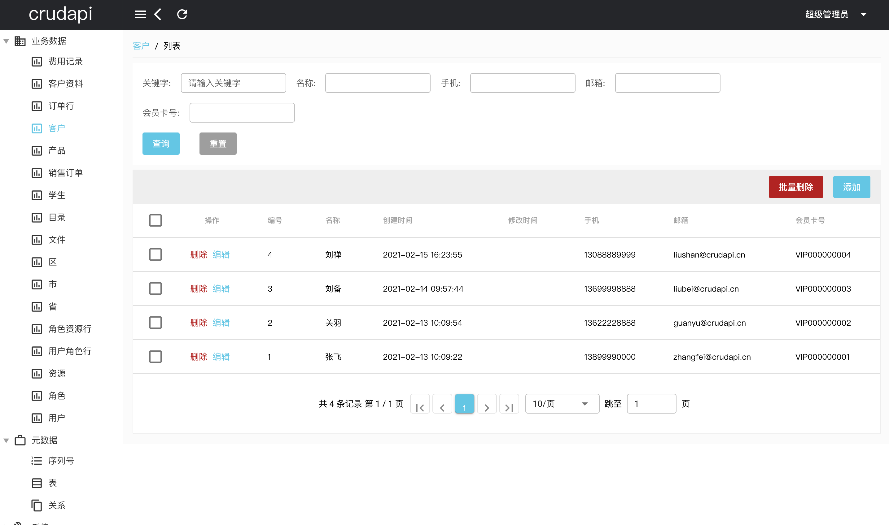

# crudapi二次开发demo

### LICENSE
[LICENSE](./LICENSE)

## 语言
[English](README.md)

## GIT地址
名称 | 类型 | 授权 | GitHub仓库 | Gitee仓库
--- | --- | --- | --- | ---
crudapi-admin-web | Vue Qusar源码 | 开源 | [crudapi-admin-web](https://github.com/crudapi/crudapi-admin-web) | [crudapi-admin-web](https://gitee.com/crudapi/crudapi-admin-web)
crudapi-example| Java集成SDK | 永久免费 | [crudapi-example](https://github.com/crudapi/crudapi-example) | [crudapi-example](https://gitee.com/crudapi/crudapi-example)

## Mysql

### 导入数据库到crudapi
./database/mysql/crudapi-mysql.sql

### 配置数据库信息
src/main/resources/application.properties
```bash
spring.datasource.driverClassName=com.mysql.cj.jdbc.Driver
spring.datasource.url=jdbc:mysql://localhost:3306/crudapi?serverTimezone=Asia/Shanghai&useUnicode=true&characterEncoding=utf8&useSSL=false&allowPublicKeyRetrieval=true
spring.datasource.username=root
spring.datasource.password=root
```

## Postgresql
### 导入数据库到模式crudapi.public
./database/postgresql/crudapi-pgsql.sql

### 配置数据库信息
src/main/resources/application.properties
```bash
spring.datasource.driverClassName=org.postgresql.Driver
spring.datasource.url=jdbc:postgresql://localhost:5432/crudapi
spring.datasource.username=postgres
spring.datasource.password=postgres
```

## Oracle
### 导入数据库到模式crudapi

./database/oracle/crudapi-oracle.sql

### 配置数据库信息
src/main/resources/application.properties
```bash
spring.datasource.url=jdbc:oracle:thin:@//localhost:1521/XEPDB1
spring.datasource.driverClassName=oracle.jdbc.OracleDriver
spring.datasource.username=crudapi
spring.datasource.password=crudapi
spring.datasource.initialization-mode=always
spring.datasource.schema=classpath:schema.sql
```

## MS SQL Server
### 导入数据库到模式crudapi.dbo

./database/mssql/crudapi-mssql.sql

### 配置数据库信息
src/main/resources/application.properties
```bash
spring.datasource.url=jdbc:sqlserver://localhost:1433;SelectMethod=cursor;DatabaseName=crudapi
spring.datasource.driverClassName=com.microsoft.sqlserver.jdbc.SQLServerDriver
spring.datasource.username=sa
spring.datasource.password=Mssql1433
```

### 下载安装依赖包
```bash
cd lib
./download.sh
```

### 编译
```bash
cd crudapi-example
mvn clean install -Dmaven.test.skip=true

#阿里云 mirror
mvn clean install -Dmaven.test.skip=true -s settings.xml
```

### 运行
```bash
cd crudapi-example
java -jar ./target/crudapi-example-1.6.2.jar
```

### swagger文档
[http://127.0.0.1:8888/swagger-ui.html](http://127.0.0.1:8888/swagger-ui.html)

### crudapi后台管理WEB
[http://127.0.0.1:8888/crudapi/](http://127.0.0.1:8888/crudapi/)

### API (二次开发)
[API](./API.md)

### crudapi后台管理WEB(二次开发)
#### GitHub仓库
[https://github.com/crudapi/crudapi-admin-web](https://github.com/crudapi/crudapi-admin-web)

#### Gitee仓库
[https://gitee.com/crudapi/crudapi-admin-web](https://gitee.com/crudapi/crudapi-admin-web)

#### 修改配置
修改quasar.conf.js文件中devServer->proxy->target

```javascript
devServer: {
  https: false,
  port: 8080,
  open: true,
  proxy: {
    "/api/*": {
      target: "http://127.0.0.1:8888",
      changeOrigin: true
    }
  }
}
```

## 演示
演示地址：[https://demo.crudapi.cn/crudapi/](https://demo.crudapi.cn/crudapi/)


表单对应不同的对象


表关系图显示不同对象之间的关系


业务数据操作

## 联系方式
#### 邮箱
admin@crudapi.cn

#### QQ
1440737304

#### QQ群
632034576

#### 微信
undefinedneqnull

<div align="left">
  
</div>

#### 微信群
<div align="left">
  
</div>

如有任何问题，欢迎咨询和交流！

